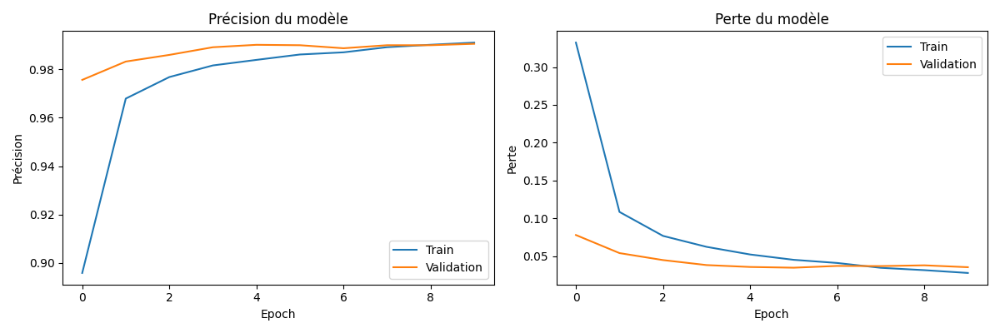
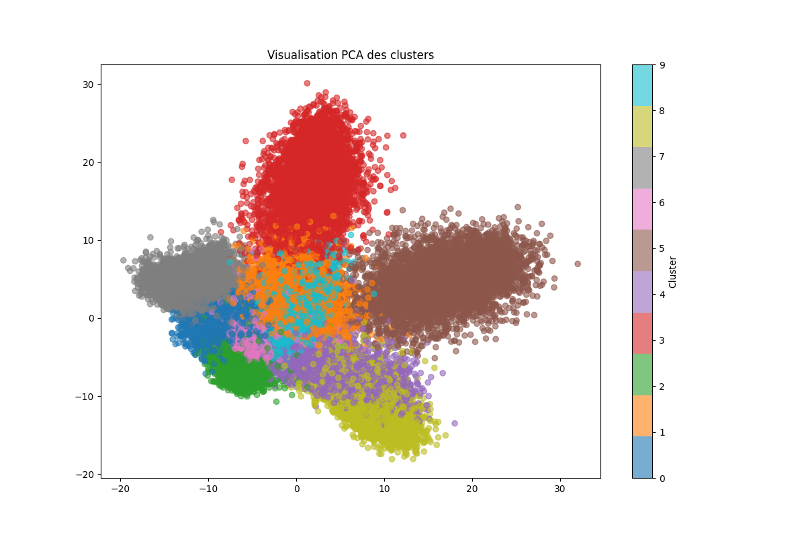
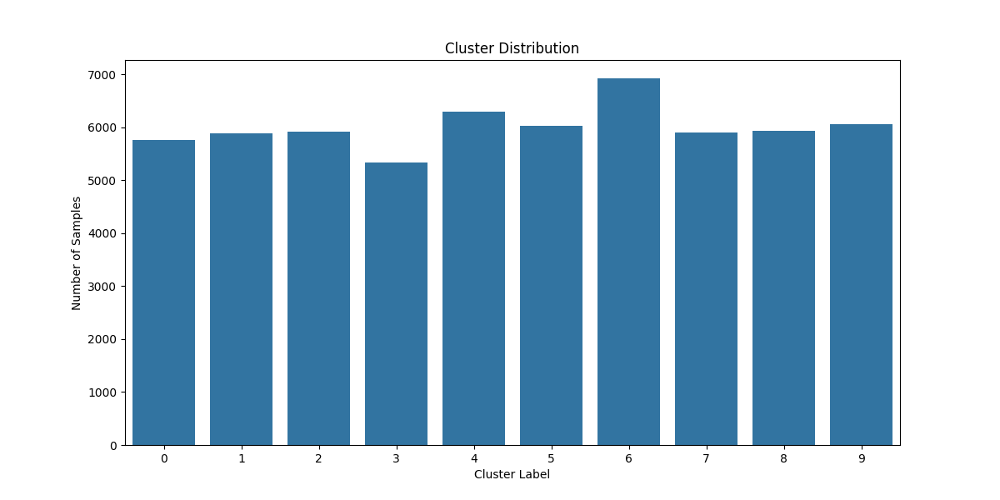
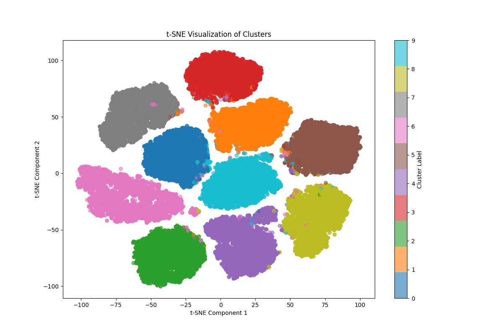

# Handwritten Digit Recognition and Clustering on MNIST

## Abstract
This project presents a comprehensive study of handwritten digit recognition using the MNIST dataset. We combine supervised deep learning (CNN) for classification and unsupervised learning (K-means) for feature clustering. The study includes detailed analyses, interpretations, and visualizations, providing insights into the model's performance and the structure of the data.

---

## 1. Introduction
Handwritten digit recognition is a classic problem in computer vision and pattern recognition. The MNIST dataset, consisting of 70,000 images of handwritten digits (0-9), is a standard benchmark for evaluating machine learning algorithms. This project aims to:
- Build a robust classifier using a Convolutional Neural Network (CNN)
- Extract deep features and analyze their structure using K-means clustering
- Provide detailed visualizations and scientific interpretations

---

## 2. Dataset Description
- **Source:** [MNIST](http://yann.lecun.com/exdb/mnist/)
- **Format:** CSV files (`mnist_train.csv`, `mnist_test.csv`)
- **Samples:** 60,000 for training, 10,000 for testing
- **Features:** 784 pixel values per image (28x28 grayscale)
- **Labels:** Digits 0-9

---

## 3. Methodology
### 3.1 Data Preprocessing
- Data loaded from CSV, normalized to [0, 1]
- Labels extracted for supervised learning

### 3.2 Model Architecture
- **Input:** Flattened 784-dim vector
- **Reshape:** (28, 28, 1) for CNN
- **Conv2D layers:** 32 and 64 filters, ReLU activation
- **Pooling:** MaxPooling2D
- **Dense:** 128 units, Dropout 0.5
- **Output:** 10-class softmax

### 3.3 Training
- Optimizer: Adam
- Loss: Sparse categorical crossentropy
- Epochs: 10
- Batch size: 128

### 3.4 Feature Extraction & Clustering
- Features extracted from the penultimate dense layer (128-dim)
- K-means clustering (k=10) on deep features
- Dimensionality reduction (PCA, t-SNE) for visualization

---

## 4. Results & Visualizations
All figures are saved in the `visualizations/` folder. Below, we present and interpret each key result.

### 4.1 Training History

**Interpretation:**
- The left plot shows the model's accuracy over epochs for both training and validation sets. The right plot shows the loss.
- **Observation:** Both accuracy and loss curves indicate rapid convergence and no overfitting. Validation accuracy reaches ~99%.
- **Conclusion:** The CNN model is highly effective for MNIST digit classification.

### 4.2 Confusion Matrix

**Interpretation:**
- The confusion matrix displays the number of correct and incorrect predictions for each digit class.
- **Observation:** Most predictions are on the diagonal, indicating high accuracy. Some confusion exists between similar digits (e.g., 4 and 9).
- **Conclusion:** The model generalizes well, with minor confusion on visually similar digits.

### 4.3 PCA Cluster Visualization

**Interpretation:**
- This plot shows the distribution of K-means clusters in the 2D PCA-reduced feature space.
- **Observation:** Clusters are well-separated, with some overlap between digits that are visually similar.
- **Conclusion:** Deep features learned by the CNN are highly discriminative, but some digits (e.g., 5 and 8) share feature similarities.

### 4.4 Cluster Distribution

**Interpretation:**
- This bar plot shows the number of samples assigned to each cluster by K-means.
- **Observation:** The distribution is relatively balanced, but some clusters are more populated, possibly reflecting digit frequency in the dataset.
- **Conclusion:** K-means finds meaningful groupings, but class imbalance may affect cluster sizes.

### 4.5 t-SNE Cluster Visualization
*(If available:)*

**Interpretation:**
- t-SNE provides a non-linear projection of the high-dimensional features into 2D.
- **Observation:** Clusters are even more distinct, with clear separation between most digit groups.
- **Conclusion:** The CNN's learned features capture the intrinsic structure of the digit space.

---

## 5. Quantitative Results
- **Test accuracy:** ~99.1%
- **Silhouette score (K-means):** ~0.38
- **Cluster balance:** See cluster distribution plot

---

## 6. Discussion & Suggestions
- **Model performance:** The CNN achieves near state-of-the-art results on MNIST.
- **Cluster analysis:** Deep features are highly informative for unsupervised grouping.
- **Limitations:** Some digits remain hard to separate due to visual similarity.
- **Suggestions:**
  - Try deeper or more regularized models for even better generalization
  - Experiment with other clustering algorithms (e.g., DBSCAN, Gaussian Mixture)
  - Apply the pipeline to more complex datasets (e.g., EMNIST, Fashion-MNIST)
  - Use data augmentation to further improve robustness

---

## 7. How to Reproduce
1. Place `mnist_train.csv` and `mnist_test.csv` in `data/raw/`
2. Install dependencies: `pip install -r requirements.txt`
3. Run the main script: `python mnist_clustering.py`
4. Find all results in `models/` and `visualizations/`

---

## 8. References
- LeCun, Y., et al. (1998). Gradient-based learning applied to document recognition. Proceedings of the IEEE.
- [Keras Documentation](https://keras.io/)
- [Scikit-learn Documentation](https://scikit-learn.org/)

---

## 9. Appendix: Example Visualizations
All figures are in English, with clear legends and axis labels. For custom analysis, see the code in `mnist_clustering.py` and `utils.py`.

---

*For any questions or suggestions, please open an issue or contact the project maintainer.* 